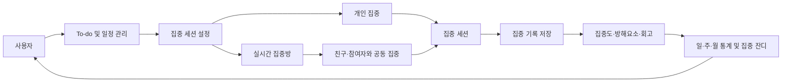
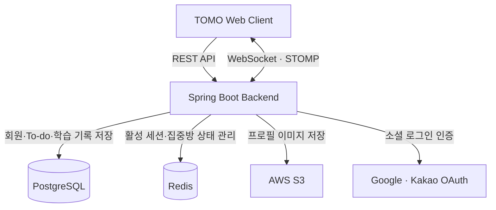

<div align="center">

# TOMO

### 계획부터 집중, 기록과 회고까지 하나로 연결하는 학습 몰입 지원 서비스

뽀모도로 집중 타이머와 실시간 집중방, To-do 및 학습 기록을 연결하여  
사용자가 꾸준한 집중 습관을 만들고 자신의 학습 과정을 관리할 수 있도록 지원합니다.

</div>

---

## 프로젝트 개요

| 구분 | 내용 |
| --- | --- |
| 프로젝트명 | TOMO |
| 프로젝트 형태 | 실시간 공동 학습 및 개인 학습 관리 플랫폼 |
| 주요 사용자 | 혼자 공부하는 시간이 많고 집중 유지와 학습 기록 관리가 필요한 대학생·취업준비생 |
| 핵심 목표 | 학습 계획부터 집중, 기록, 회고와 통계까지 하나의 흐름으로 연결 |
| MVP 플랫폼 | Web |
| 핵심 경험 | To-do → 집중 세션 → 실시간 집중방 → 기록 → 회고 → 통계 |

---

## 프로젝트 배경

학습자는 시험, 과제, 자격증, 어학과 취업 준비 등 다양한 목표를 스스로 관리해야 하지만 스마트폰 알림, SNS와 주변 환경 등의 방해요소로 인해 집중 상태를 지속하기 어렵습니다.

또한 To-do, 캘린더, 집중 타이머, 공부시간 기록과 온라인 스터디가 서로 다른 서비스에 분산되어 있어 계획한 학습과 실제 집중 행동, 그 결과를 하나의 흐름으로 관리하기 어렵습니다.

혼자 공부하는 환경에서는 다른 학습자와 함께 집중하거나 서로의 학습 상태를 확인할 기회가 부족하여 학습을 지속할 동기를 유지하기도 어렵습니다.

TOMO는 학습 계획과 집중 행동을 연결하고, 실시간 집중방을 통해 다른 사용자와 함께 공부하며, 세션 종료 후 기록과 회고를 바탕으로 자신의 학습 습관을 확인할 수 있는 학습 몰입 지원 서비스를 개발하고 있습니다.

---

## TOMO가 해결하려는 문제

### 계획과 실행이 분리되는 학습 관리

To-do를 작성하더라도 실제 집중 행동과 연결되지 않으면 계획 대비 수행 결과를 확인하기 어렵습니다.

TOMO는 To-do를 집중 세션에 연결하여 계획한 학습이 실제 공부 행동으로 이어지도록 지원합니다.

### 여러 서비스에 분산된 학습 과정

일정 관리, 집중 타이머, 공부시간 기록과 회고가 서로 다른 서비스에 분산되면 학습 과정을 통합적으로 관리하기 어렵습니다.

TOMO는 계획, 집중, 기록, 회고와 통계를 하나의 서비스에서 연결합니다.

### 혼자 공부할 때 부족한 동기부여

혼자 공부하는 환경에서는 긴장감과 외부 동기부여가 부족하여 집중을 오래 유지하기 어렵습니다.

TOMO는 공개·비공개 집중방, 친구 초대, 친구 따라가기와 같이 달리기를 통해 공동 집중 경험을 제공합니다.

### 확인하기 어려운 집중 습관

공부가 끝난 후 실제 집중시간, 목표 달성 여부, 화면 이탈과 방해요소를 체계적으로 확인하기 어렵습니다.

TOMO는 집중 기록, 집중도, 방해요소, 한 줄 회고와 일·주·월 통계를 통해 사용자가 자신의 학습 패턴을 확인하도록 돕습니다.

---

## 서비스 이용 흐름



TOMO의 각 저장소는 위 흐름에서 웹 서비스와 서버 구현 영역을 담당하며, 사용자·To-do·집중 세션·집중방·학습 기록 데이터를 중심으로 연결됩니다.

---

## 서비스 구성

### 웹 애플리케이션

사용자가 To-do와 일정을 관리하고 개인 집중 또는 집중방을 선택하여 학습을 진행할 수 있는 환경을 제공합니다.

홈 대시보드, To-do, 캘린더, 집중 타이머, 집중방, 친구, 기록·회고, 통계와 알림 등 사용자 중심 기능을 담당합니다.

### 백엔드 서버

사용자 인증과 권한, To-do, 집중 세션, 집중방, 친구 관계, 학습 기록, 통계, 알림과 신고 정책을 처리합니다.

계정당 하나의 활성 집중 세션만 허용하고, 집중방 정원과 방장 권한을 관리하며, 서버 시간을 기준으로 집중 상태와 기록의 일관성을 유지합니다.

### 실시간 집중 시스템

집중방 참여자의 입장·퇴장과 대기·집중·일시정지·휴식 상태를 실시간으로 동기화합니다.

네트워크 연결이 끊어진 경우 5분 동안 세션과 방 참여 상태를 유지하고, 재접속 시 서버에 저장된 상태를 기준으로 세션을 복구합니다.

### 데이터 플랫폼

사용자, To-do, 집중 세션, 집중방, 친구, 회고, 알림과 신고 데이터를 관계형 데이터로 관리합니다.

집중시간, 목표 달성률, 뽀모도로 완료 횟수, 집중 잔디와 연속 학습일 등 통계 데이터는 저장된 원본 학습 기록을 기준으로 계산합니다.

---

## Repository Guide

TOMO는 웹 클라이언트와 백엔드 서버를 분리하여 운영합니다.

| 저장소 | 담당 영역 | 설명 |
| --- | --- | --- |
| [backend](https://github.com/tomo-project/backend) | Backend | 인증·인가, To-do, 집중 세션, 실시간 집중방, 친구, 기록, 통계와 알림 API를 관리합니다. |
| [frontend](https://github.com/tomo-project/frontend) | Frontend | 웹 애플리케이션의 화면과 사용자 경험을 관리합니다. |
| [workflow](https://github.com/tomo-project/workflow) | Workflow | GitHub Actions 워크플로를 개발·관리합니다. |
| [infrastructure](https://github.com/tomo-project/infrastructure) | Infrastructure | 개발·운영 환경의 Terraform 구성, 재사용 인프라 모듈, 환경별 변수와 인프라 검증 워크플로를 관리합니다. |

각 저장소의 구체적인 기술 스택, 프로젝트 구조와 개발 규칙은 해당 저장소의 README에서 확인할 수 있습니다.

---

## 시스템 책임 분리



PostgreSQL은 영속 데이터의 원본 저장소로 사용하며, Redis는 활성 집중 세션, 집중방 참여 상태, 재접속 복구 데이터와 서버 간 실시간 이벤트를 관리합니다.

---

## 주요 사용자

### 여러 학습 목표를 관리하는 대학생

시험, 과제, 자격증 등 여러 학습을 병행하며 계획과 실제 공부 기록을 함께 관리하려는 사용자입니다.

### 장기간 자기주도 학습을 진행하는 취업준비생

어학, 자격증, 코딩테스트와 직무 공부를 진행하며 학습량과 집중시간을 체계적으로 확인하려는 사용자입니다.

### 집중 습관을 만들고 싶은 학습자

공부를 시작하더라도 꾸준히 지속하기 어렵고 집중 잔디와 연속 학습일을 통해 성취감을 얻고 싶은 사용자입니다.

### 다른 사람과 함께 공부하고 싶은 학습자

혼자 공부할 때 부족한 긴장감과 동기부여를 실시간 집중방과 친구 기능으로 보완하려는 사용자입니다.

---

## 프로젝트 차별점

### 계획부터 결과까지 연결되는 학습 경험

To-do를 작성하는 데서 끝나지 않고 실제 집중 세션, 기록, 회고와 통계로 이어지는 학습 흐름을 제공합니다.

```text
계획
→ 집중
→ 공동 학습
→ 기록
→ 회고
→ 통계
```

### 개인 집중과 실시간 공동 집중의 결합

개인 타이머뿐 아니라 공개·비공개 집중방, 익명 참여, 친구 초대, 친구 따라가기와 같이 달리기를 지원합니다.

집중방에서는 사용자마다 자신의 타이머를 사용하고 다른 참여자에게는 현재 집중 상태만 공유합니다.

### 구체적인 집중 과정 기록

단순 공부시간뿐 아니라 완료·중단 여부, 일시정지, 휴식시간, 화면 이탈 횟수와 시간, 집중도, 방해요소와 한 줄 회고를 함께 관리합니다.

### 서버 중심의 일관된 세션 관리

여러 기기와 브라우저에서 로그인할 수 있지만 계정당 활성 집중 세션은 하나로 제한합니다.

네트워크 오류와 새로고침이 발생해도 서버에 저장된 상태와 시간을 기준으로 세션을 복구합니다.

---

## 핵심 기능

### 소셜 로그인과 계정 설정

Google과 Kakao 소셜 로그인을 지원하며 최초 로그인 시 닉네임과 선택적 프로필 이미지를 등록합니다.

알림 수신 여부와 친구 따라오기 허용 여부 등 서비스 설정을 사용자 계정 기준으로 관리합니다.

### To-do와 일정 관리

To-do 생성·조회·수정·삭제와 완료 처리를 지원합니다.

카테고리, 우선순위, 마감일, 예상 학습시간과 알림 시간을 설정하고 일·주·월 캘린더에서 일정을 확인할 수 있습니다.

### 집중 타이머

집중시간, 휴식시간과 반복 횟수를 설정하여 뽀모도로 기반 집중 세션을 진행합니다.

집중 시작, 일시정지, 재개, 연장, 중단과 완료를 지원하며 To-do를 선택적으로 연결할 수 있습니다.

### 실시간 집중방

공개방과 비공개방을 생성하고 최대 10명까지 함께 공부할 수 있습니다.

비공개방 비밀번호, 선택적 방장 승인, 일반·익명 참여, 참여자 강퇴, 신고, 방장 위임과 집중방 종료 기능을 제공합니다.

### 친구와 공동 집중

사용자 검색, 친구 요청·수락·거절·삭제와 친구의 공개된 집중 상태 확인을 지원합니다.

친구 집중방 초대, 친구 따라가기와 같이 달리기를 통해 공동 학습을 시작할 수 있습니다.

### 집중 기록과 회고

집중 시작·종료 시각, 실제 순공시간, 완료·중단 여부, 일시정지·휴식시간과 화면 이탈 정보를 기록합니다.

세션 종료 후 집중도, 복수 방해요소와 선택적 한 줄 회고를 작성할 수 있습니다.

### 통계와 성취

일간·주간·월간·누적 집중시간, 집중 세션 수, 뽀모도로 완료 횟수, 목표 달성률과 카테고리별 집중시간을 제공합니다.

하루 순공시간을 기준으로 집중 잔디와 연속 학습일을 계산합니다.

### 서비스 내 알림

To-do 일정, 친구 요청, 집중방 초대·참여 승인과 같이 달리기 요청에 대한 서비스 내 알림을 제공합니다.

사용자는 알림 유형별 수신 여부를 설정하고 읽음·읽지 않음 상태를 관리할 수 있습니다.

---

## 팀원 소개

<table align="center">
  <tr>
    <td align="center" width="180">
      <a href="https://github.com/sooloin">
        
        <br/>
        <b>조수빈</b>
      </a>
      <br/>
      Frontend Lead · Design
    </td>
    <td align="center" width="180">
      <a href="https://github.com/Anchovia">
        
        <br/>
        <b>전병훈</b>
      </a>
      <br/>
      Frontend
    </td>
    <td align="center" width="180">
      <a href="https://github.com/minzx23">
        
        <br/>
        <b>강민주</b>
      </a>
      <br/>
      Frontend
    </td>
  </tr>
  <tr>
    <td align="center" width="180">
      <a href="https://github.com/WhiteBin-bin">
        
        <br/>
        <b>백현빈</b>
      </a>
      <br/>
      Backend Lead · Product Manager
    </td>
    <td align="center" width="180">
      <a href="https://github.com/KJK1023">
        
        <br/>
        <b>김재균</b>
      </a>
      <br/>
      Backend
    </td>
    <td align="center" width="180">
      <a href="https://github.com/seul15">
        
        <br/>
        <b>이슬</b>
      </a>
      <br/>
      Backend
    </td>
  </tr>
</table>

---

## 협업 방식

### 명세 기반 개발

기획서, IA, 서비스 정책, 요구사항 정의서, 기능 명세서와 API 명세서를 기준으로 기능을 구현합니다.

기획과 정책이 다른 문서와 충돌하는 경우 기획서와 서비스 정책을 우선하여 팀 간 구현 기준을 일치시킵니다.

### 요구사항과 기능 ID 연결

요구사항은 `REQ-001` 형식으로, 기능은 `FNC-001` 형식으로 관리하며 관련 IA 화면과 연결합니다.

이를 통해 요구사항, 기능, 화면과 구현 결과를 추적할 수 있도록 관리합니다.

### 각 파트별 Pull Request 기반 검토

기획·디자인·프론트엔드·백엔드는 각 파트의 변경 사항을 Pull Request로 공유하고, 파트별 기준에 따라 검토한 후 반영합니다.

### 이슈 단위 작업 관리

기능을 작업 가능한 단위로 분리하고 GitHub Issue를 통해 작업 목적, 담당자와 진행 상태를 관리합니다.

### 보안 정보 관리

API Key, 인증 정보, 비밀번호, 토큰과 실제 환경변수 파일 등 외부에 공개되면 안 되는 정보는 저장소에 업로드하지 않습니다.

예시 파일에는 협업에 필요한 항목과 형식만 작성하고 실제 값과 민감한 정보는 별도로 관리합니다.

---

## 프로젝트 발전 방향

### MVP 구축

계정·설정, 홈, To-do, 집중 타이머, 실시간 집중방, 친구, 기록·회고, 통계·성취와 서비스 내 알림을 중심으로 핵심 학습 흐름을 구현합니다.

### 그룹과 챌린지

학습 그룹, 그룹 집중방, 챌린지, 그룹 랭킹, 출석과 연속 학습 기록을 추가하여 공동 학습 경험을 확장합니다.

### 리워드와 게이미피케이션

집중 완료, 출석과 연속 학습 성취를 포인트, 보상과 펫 성장에 연결하여 지속적인 학습 동기를 제공합니다.

### 학습 분석과 개인화

화면 이탈, 방해요소, 시간대와 과목별 학습 기록을 분석하고 적절한 집중시간과 개인 공부 계획을 추천합니다.

### 플랫폼 확장

외부 캘린더, 모바일 앱, 데스크톱 위젯과 브라우저 확장 프로그램으로 확장하며 서버의 활성 집중 세션을 기준으로 여러 플랫폼의 상태를 동기화합니다.

### 서비스 모델 확장

광고 제거, 프리미엄 구독, 유료 테마·타이머, 펫·꾸미기 아이템과 교육기관·스터디 대상 B2B 기능을 검토합니다.
